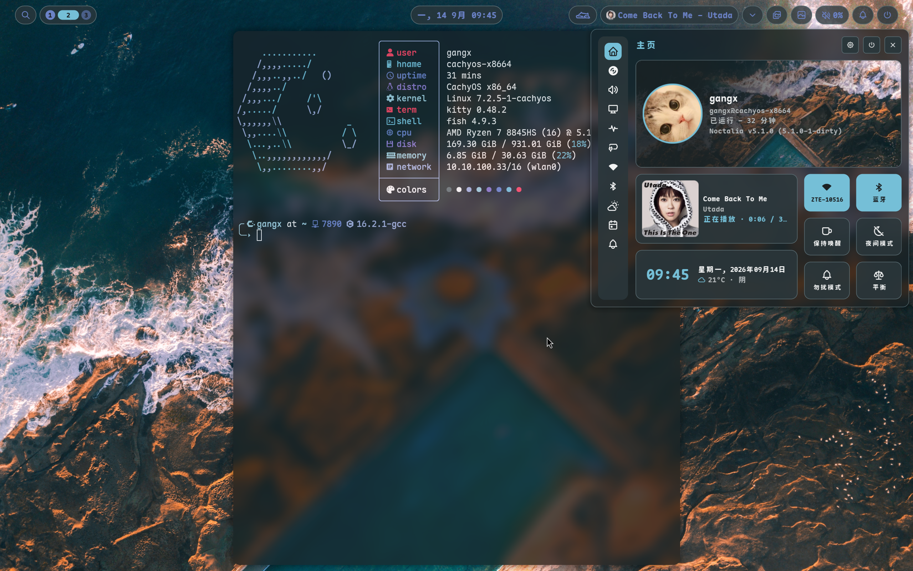

# dotfiles

个人 dotfiles 仓库：stow 风格布局 + 符号链接部署。收录当前正在使用的
窗口管理器、终端、nvim、emacs 配置，以及驱动配色的 Noctalia 模板。

## 布局

```
dotfiles/
├── stow/                       # stow 包：stow/<pkg>/<相对 $HOME 的路径>
│   ├── niri/.config/niri/…
│   ├── kitty/.config/kitty/…
│   ├── alacritty/.config/alacritty/
│   ├── foot/.config/foot/
│   ├── hypr/.config/hypr/…
│   ├── noctalia/.config/noctalia/…
│   └── noctalia-integrations/.config/{labwc,sway,mango,umbriel,scroll}/
├── external/                   # 独立 git 仓库（nvim / emacs），见 external/README.md
└── install.sh                  # 部署脚本
```

`install.sh` 建立的是**相对符号链接**（GNU stow 默认行为），所以整个仓库
平移后链接依然有效。

## 用法

```bash
cd ~/dotfiles
./install.sh link                    # 建立/刷新链接
./install.sh status                  # 只读检查 ok / missing / conflict
./install.sh unlink                  # 卸载（只删指向本仓库的链接）
./install.sh link --replace-identical  # 迁移：实体文件与仓库逐字节相同时替换成链接
```

## 依赖

### 会话与桌面（`stow/niri`、`stow/noctalia`）

| 包 | 用途 |
|---|---|
| `niri` | 主窗口管理器，读 `config.kdl` 及拆分配置 |
| `noctalia` | 配色 / 面板 / 壁纸引擎，渲染 `themes/noctalia.*`、`niri/noctalia.kdl` |
| `kitty` | 终端；`binds.kdl` 的打开终端与 scratchpad 脚本默认调用它 |
| `fish` | `kitty.conf` 里 `shell fish` |
| `wlsunset` | EyeCare 护眼模式的色温调节 |
| `mpvpaper` + `ffmpeg` | 动态壁纸 |
| `jq` | 脚本解析 `niri msg --json`、`hyprctl -j` 的输出 |
| `python-gobject` + `gtk3` + `gtk-layer-shell` + `python-cairo` | Orbit 启动器与壁纸选择器的 GTK3 层壳界面（脚本里要求 `Gtk 3.0`） |
| `wl-clipboard` | kitty 全选复制、脚本写剪贴板 |
| `libnotify` | `notify-send` 通知（EyeCare 开关提示） |
| `util-linux` | `flock`，EyeCare 切换的串行锁（基础系统自带） |
| `tmux` | scratchpad 终端用 `tmux new-session -A -D`；缺失时退化为普通 kitty |
| `fzf` | 脚本里的列表选择 |

### 编辑器

| 包 | 用途 |
|---|---|
| `neovim`（≥ 0.12） | `external/nvim`；使用内置 `vim.pack`，版本锁定在 `nvim-pack-lock.json` |
| `ripgrep`、`fd` | 搜索（telescope 等） |
| `unzip`、`gcc`、`make` | 插件解压与 Treesitter/LSP 编译 |
| `nodejs`、`npm` | 部分 LSP 与插件的运行时 |
| `tree-sitter-cli` | 解析器编译 |
| `emacs`（≥ 29） | `external/emacs`（Centaur Emacs） |

### 字体

| 包 | 用途 |
|---|---|
| `maple-mono-nf-cn-unhinted`（AUR） | kitty / alacritty 使用的 `Maple Mono NF CN`，字重由 fontconfig 统一为 ExtraBold |
| `noto-fonts-cjk` | 中文 fallback |

### 可选

| 包 | 用途 |
|---|---|
| `hyprland` | 只有 `stow/hypr` 需要（当前主会话是 niri） |
| `grim`、`slurp` | `stow/hypr` 的截图脚本 `hypr-shot.sh` |
| `alacritty` | `stow/alacritty` |
| `foot` | `stow/foot`（本机未安装，配置先备着） |
| `nautilus` | `binds.kdl` 里的文件管理器快捷键 |
| `flatpak`、`missioncenter` | 脚本检测到才调用，缺失不影响 |
| `agda`、`sbcl`、`ocaml`、`lean`（elan）、`coq`/rocq、`dune` | nvim / emacs 里对应语言插件的工具链，按需安装 |

## 安装

### 1. 安装依赖

```bash
sudo pacman -S --needed niri noctalia kitty alacritty fish wlsunset mpvpaper ffmpeg \
  jq python-gobject gtk3 gtk-layer-shell python-cairo wl-clipboard libnotify util-linux \
  tmux fzf neovim ripgrep fd unzip gcc make nodejs npm tree-sitter-cli emacs noto-fonts-cjk
```

字体在 AUR，用 `paru`（或 `yay`）：

```bash
paru -S --needed maple-mono-nf-cn-unhinted
```

只有用到对应配置才需要：

```bash
sudo pacman -S --needed hyprland grim slurp foot nautilus
```

### 2. 克隆仓库

```bash
git clone https://github.com/qukuqhd/dotfiles ~/dotfiles
git clone <你的 kickstart fork> ~/dotfiles/external/nvim
git clone <你的 Centaur fork>   ~/dotfiles/external/emacs
```

`external/` 下的两个目录是独立 git 仓库，不放进 dotfiles 的版本控制；没有它们
`install.sh link` 只会提示缺失，不影响其余包。

### 3. 部署链接

```bash
~/dotfiles/install.sh link
~/dotfiles/install.sh status
```

如果接管的目录里已有实体配置文件（例如从旧机器拷来的），第一次用：

```bash
~/dotfiles/install.sh link --replace-identical
```

它只在内容与本仓库逐字节一致时才替换成链接，不一致的会报冲突交给你手动处理。

装了 GNU stow 的话也可以按包单独部署（务必加 `--no-folding`，否则会整目录
折叠成一个链接，把运行时生成的文件也卷进仓库）：

```bash
stow --no-folding -t ~ -d ~/dotfiles/stow niri
```

### 4. 验证

```bash
niri validate -c ~/.config/niri/config.kdl
nvim --headless "+lua print('ok')" +q
emacs --batch --eval '(message "ok")'
```

首次进入会话后 Noctalia 才会渲染主题文件；若 `kitty/themes/noctalia.conf`
还没生成，执行一次 `noctalia msg templates-apply` 即可。

## 与 [NyxNiri](https://github.com/ech678/NyxNiri) 的关系

[`~/NyxNiri`](https://github.com/ech678/NyxNiri) 仍在管理 `fish`、`starship`、`fastfetch`、`zed`、
`xdg-desktop-portal` 等系统层配置，部署方式是**复制**。它与本仓库重叠的
只有 `.config/niri` 和 `.config/kitty`：

- 重新运行 `nyxniri` 的安装/更新流程会覆盖这两个目录里的符号链接。
- 需要改 niri/kitty 时，请改本仓库后 `./install.sh link`，不要再走 [NyxNiri](https://github.com/ech678/NyxNiri)。

## 主题链路

Noctalia 是配色的单一来源：它渲染 `~/.config/<app>/themes/noctalia.*`、
`niri/noctalia.kdl`、`nvim/lua/matugen.lua`，并通过
`templates/nvim/apply.sh`、`templates/emacs/apply.sh` 通知运行中的编辑器
重载配色。因此本仓库只保存模板与静态配置，渲染产物一律现算。
